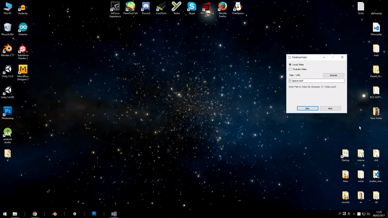
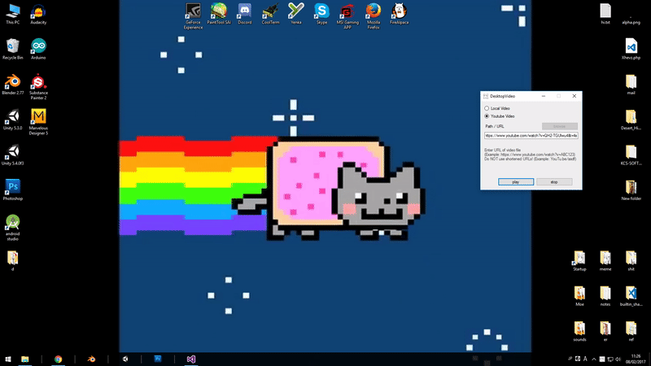

# DesktopVideo

Set local or YouTube videos as desktop wallpaper!

Videos will loop automatically.

Application will be hidden to system tray when minimized.

## Local Video Example



## Youtube Video Example



## Misc

* modify startup.txt to run video automatically.

  local:
  ```
  type=0
  src="path-to-local-video"
  ```
  youtube:
  ```
  type=1
  src="url-to-youtube-video"
  ```